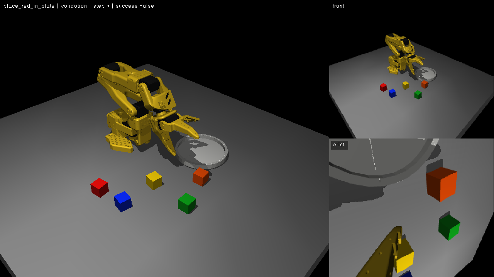

# SO-101 仿真 Benchmark

独立开发的 MuJoCo / Gymnasium 环境，通过 `lerobot_env_so101` 插件接入同级 LeRobot。
提供五色指令入盘和蓝块叠红块，共六项任务；支持 π0、π0.5、SmolVLA 的本地和远程推理。



## 安装与快速运行

以下命令均在 `so101_benchmark/` 中执行，需要 Python 3.12+。项目固定 MuJoCo 3.3.7，
SO-101 资产已经随包提供，模型权重通过路径引用。

```bash
# 仿真、视频输出和测试；不安装策略模型依赖
uv sync --locked --extra test

# 需要接入 LeRobot 和模型时
uv sync --locked --extra policies --extra remote --extra test

uv run so101-bench list
uv run so101-bench preview --config configs/fixed.yaml
uv run so101-bench preview --config configs/fixed.yaml --display
uv run so101-bench eval --config configs/benchmark.yaml
```

本次开发已准备 `.venv`，它复用了现有 `soarm101` 环境的 PyTorch/LeRobot，
新增依赖只安装在本项目虚拟环境。可以直接使用：

```bash
uv run --no-sync so101-bench preview --display
uv run --no-sync so101-bench eval --config configs/smoke.yaml
```

`smoke.yaml` 关闭相机渲染与视频，用于快速运行物理脚本基线；它不适用于视觉模型。
基线读取物体真实位置，通过 IK 和夹爪接触操作方块，成绩用于验证环境可完成性。

无窗口默认使用 OSMesa 软件渲染，需要系统提供 `libOSMesa.so`。Ubuntu 可安装
`libosmesa6`。有 NVIDIA GPU 时，将 `sim.render_backend` 设为 `egl`。
`--display` 自动选择 GLFW，需要可用的桌面显示服务；采集端不需要加载模型权重。

## 任务与成功规则

| ID | 指令目标 | 场景 |
| --- | --- | --- |
| `place_red_in_plate` | 红块入盘 | 红、蓝、绿、黄、橙五块和一个盘子 |
| `place_blue_in_plate` | 蓝块入盘 | 同上 |
| `place_green_in_plate` | 绿块入盘 | 同上 |
| `place_yellow_in_plate` | 黄块入盘 | 同上 |
| `place_orange_in_plate` | 橙块入盘 | 同上 |
| `stack_blue_on_red` | 蓝块放在红块上 | 红蓝两块 |

五色任务在相同 seed 下具有相同布局，各自绑定目标 ID 和英文指令，逐项计分。
目标需要有机械臂接触和离桌抬升记录。入盘要求整个目标在盘沿内并得到盘面支撑；
其他方块不能占据盘内区域。允许碰动其他方块、误放后取出纠正。

叠放要求蓝块在红块上获得支撑，红块仍在桌上，两块直立。默认中心横向偏差小于
较小方块边长的 30%，高度误差小于 4 mm。成功时机械臂必须脱离所有方块，目标
（叠放时两块）连续稳定 1 秒；线速度阈值 0.01 m/s，角速度阈值 0.1 rad/s。
抬升、支撑、稳定计时均由物理状态判定；未释放、掠过盘面和短暂接触不能成功。
方块跌落桌下为终止失败，时间耗尽为截断失败。默认不要求机械臂复位。

默认方块边长 25 mm、质量 10 g，盘子为外边长 100 mm 的圆角正方形，圆角半径
暂取 12 mm，颜色为浅蓝；盘底及盘沿厚度均为 2 mm，盘沿高出底面 6 mm，
总高度 8 mm；控制频率 30 Hz，物理频率
600 Hz，每回合最多 60 秒。所有评测使用固定的 MuJoCo 资产版本和采样参数记录。

六项任务共用浅蓝渐变天空、明亮照明与无限延展的视觉地面。桌面仍为操作区域，
外围地面不参与碰撞，方块跌落失败规则保持不变。五色方块默认位于距底座约
15–24 cm 的紧凑区域；叠放两块位于前方 19 cm、左右各 4.5 cm，中心间距 9 cm。
默认位置扰动为每轴 ±5 mm，朝向扰动为 ±5°；关闭布局随机化时使用固定位置。
入盘和叠放任务均可通过任务 YAML 的 `params.positions` 覆盖各颜色的 `[x, y]`。
布局与视觉更新后，旧评测分数和录像不应直接作为当前版本的结果。

## 配置、推理和结果

配置参考 `configs/benchmark.yaml`。CLI 支持覆盖任务、回合数、seed、模式、输出、显示和视频：

```bash
uv run so101-bench eval --config configs/benchmark.yaml \
  --task place_blue_in_plate,stack_blue_on_red --episodes 10 --seed 0 --no-display

uv run so101-bench eval --config configs/pi05_local.yaml --mode sync
uv run so101-bench eval --config configs/pi05_remote.yaml --mode realtime
```

`policy.backend` 为 `scripted/local/remote`；模型类型为 `pi0/pi05/smolvla`。
`pi0_local.yaml`、`smolvla_local.yaml` 等待填入你自己的 SO-101 检查点。
模型应携带已保存的 processor 与归一化统计，采用六维 SO-101 绝对关节控制。
状态/动作顺序为 `shoulder_pan, shoulder_lift, elbow_flex, wrist_flex, wrist_roll, gripper`；
前五维为角度，夹爪为 `0–100`。内部统一转换成 MuJoCo 弧度，并取关节限位。
`sim.joint_signs` 和 `sim.joint_offsets_deg` 控制实机零位映射，转换为
`q_sim = radians((角度 - offset) * sign)`。当前 offsets 默认为 `[0, 0, 0, 0, 90]`：
Leader 的 wrist_roll 零度映射到仿真 -90°，整个夹爪及相机支架随关节朝向正前方，
没有平移相机支架几何。反向状态转换使用同一偏移；旧模型的标定需与该设置一致。

两路图像是 RGB uint8，默认 640×480。名称不同的检查点可配置：

```yaml
policy:
  rename_map:
    observation.images.front: observation.images.camera1
    observation.images.wrist: observation.images.camera2
```

三类策略使用 LeRobot 自身的配置、`predict_action_chunk` 和 pre/postprocessor，
包括动作反归一化及空相机处理。首版支持它们标准的单帧观测配置。
本地检查点路径和输出路径相对运行目录；远程检查点路径由服务器解释。

远程示例使用独立 `127.0.0.1:8081` 服务，跨机器时填写实际地址。服务器必须使用
与客户端匹配的 LeRobot 版本，以及相同控制频率；`policy.server_fps` 默认为 30，
客户端会检查返回动作的时间间隔。PolicyServer 是单客户端会话，运行 benchmark
期间使用专用实例；每个回合的 `Ready` / 策略设置会清理该实例的状态。

```bash
# 在持有模型与 GPU 的服务器上启动独立实例
HF_HUB_OFFLINE=1 TRANSFORMERS_OFFLINE=1 \
uv run python -m lerobot.async_inference.policy_server \
  --host=127.0.0.1 --port=8081 --fps=30
```

同步模式暂停物理时间等待推理。实时模式保持控制步进，剩余动作到一半时请求下一段，
新段覆盖重叠的未来动作，过时动作丢弃；没有可用动作时保持上一目标，连续 10 秒
没有新动作则结束回合。模型加载和首段准备放在回合计时之外，并单独记录 setup 时间。
运行器保持单请求在途，并按回合 ID 拒绝旧结果。两种模式通过独立运行目录分别统计。

随机化分为五组，每组独立开关和范围：

- `layout`：物体/盘子位置扰动和方块朝向。
- `appearance`：灯光亮度与桌面灰度，保持方块语义颜色。
- `camera`：front/wrist 的位置和旋转扰动，overview 保持固定。
- `size`：方块尺寸比例。
- `physics`：方块质量和摩擦比例。

默认只开启布局随机化；关闭组不会消耗其他组的随机数序列。无效/重叠布局有采样上限，
超过上限明确报错。更大的随机化范围需重新检查任务可达性和物理基线成功率。
相机可以通过 `sim.cameras.front/overview` 的 `position/target/fovy` 调整，
`sim.cameras.wrist` 支持 `pos/euler/fovy`（局部米/弧度，fovy 为度）。
front 默认位置为 `[0.45, 0, 0.35]` 米（基座前方为 +X），
向下朝机械臂方向俯视 60°，垂直视场角为 86°；光轴与桌面相交于约 `[0.2479, 0, 0]`。
默认姿态写在 `task_scenes/common.xml`：

```xml
<camera name="front" pos="0.45 0 0.35"
        xyaxes="0 1 0 -0.8660254037844386 0 0.5" fovy="86" />
```

front 与 wrist 的默认垂直视场角分别为 86° 和 90°，按用户提供的商家参数设置。
`xyaxes` 是相机局部 X、Y 轴在世界坐标中的方向，镜头沿局部 -Z 看出去。
下俯角为 θ 时，此处可写 `0 1 0 -sin(θ) 0 cos(θ)`；`fovy` 是视场角，不是下俯角。
遥操作主窗口默认显示青色相机示意外壳/视野框、黄色光心/朝向箭头，位置和朝向
直接跟随最终仿真相机。外壳为示意尺寸，不代表实物相机外形；仅在主窗口渲染，
不参与碰撞，也不写入 front/wrist 图像。可通过 `sim.cameras.front.show_pose: false` 关闭。

从基座开始计数，第二舵机为 `shoulder_lift`；其外壳和安装座碰撞体位于 `shoulder`，
命名为 `second_servo_housing`、`second_servo_mount`。它们设置 `friction="0 0 0"`、
`condim="1"`、`priority="2"`，接触仅保留法向约束；高优先级避免对方几何的摩擦覆盖。
长臂 `upper_arm`、关节自身 `frictionloss` 及阻尼不变。零摩擦不会取消实体碰撞。


每次运行输出：

```text
outputs/<时间戳>_<模式>_<后端>/
  config.json, provenance.json, results.json, episodes.csv
  <任务>/seed_<编号>/
    metadata.json, scene.xml, summary.json, transitions.jsonl
    overview.mp4, front.mp4, wrist.mp4
```

每条 transition 保存动作前状态/图像对应的完整 MuJoCo 快照、请求动作、实际执行动作、
动作后的指标及 sim/wall 时间。视频一帧对应一条 transition。显示窗口左键旋转第三视角、
右键平移、滚轮缩放、Esc 关闭；front/wrist 显示原始策略输入帧。
overview 录像采用固定观察相机，不受鼠标改变视角影响，便于复现比较。

报告包含逐任务成功率、推理耗时、过期动作、断供、控制超时和实际仿真速度。
实时速度低于目标的 90% 时标记 `realtime_timing_valid=false`，另提供仅纳入有效
时间预算回合的统计。模型实际任务分数与脚本基线成绩分别记录。

```bash
# 按存储的状态重建三路视频，也可加 --display
uv run so101-bench replay --episode-dir outputs/<运行>/<任务>/seed_000000
```

回放使用原配置和已记录的关节/物体状态；请保留任务定义与本项目版本。
回放优先加载保存的 `scene.xml`；旧输出缺少该文件时，才从任务定义重建。
外部网格资源与任务评分代码仍需保留；这不保证任意跨版本兼容。

## 可编辑 XML 场景

内置六个任务直接加载仓库根目录 `task_scenes/<任务 ID>.xml`，共享 `common.xml` 中的
机械臂、桌面、灯光、天空和相机。任务 XML 包含物体及盘子几何；可以用 MuJoCo 直接打开。
运行时会展开 include，并在内存副本上应用配置和随机化，不改写源 XML。
修改后重新启动环境即可生效；当前会话的 R/Space 用于恢复该回合最初布局。

任务 YAML 的 `scene` 指定 XML 文件。相对路径先相对任务 YAML 解析，内置文件名再从
`task_scenes` 包查找；场景 XML 及机器人资源也会随 wheel 分发。
XML 默认值 → 显式任务参数/相机 YAML 设置 → 已启用随机化，按此顺序生效。
物体位置、颜色、质量以及盘子评分尺寸读取最终场景，不被 Python 默认值覆盖。
方块使用 `<body name="red">`、`<freejoint>` 和 `<geom name="red_geom" type="box">` 等命名；
任务目标必须保留。盘子保持圆盘或圆角方盘结构，编辑轮廓时应同步调整底面和盘沿几何。
新增任意形状或评分规则仍需实现对应 Python Task。

## 扩展任务与遥操作

任务由 YAML 指定 ID、Python 类、指令和参数。内置任务目录自动扫描；用户目录通过
`task_paths` 配置，相对 YAML 所在目录解析。ID 必须唯一；无需修改中央注册表。

```yaml
# 自定义任务目录中的 blue_small_plate.yaml
id: blue_small_plate
class: lerobot_env_so101.tasks.manipulation:PlaceInPlate
instruction: Pick up the blue cube and place it in the small plate.
params:
  target: blue
  colors: [red, blue, green, yellow, orange]
  cube_size: 0.025
  cube_mass: 0.010
  plate_radius: 0.05
  plate_shape: rounded_square
  plate_corner_radius: 0.012
  plate_base_thickness: 0.002
  plate_wall_thickness: 0.002
  plate_rim_height: 0.006
  plate_xy: [0.18, 0.10]
  stable_seconds: 1.0
```

新行为继承 `Task`，实现 `scene()` 和 `evaluate(env)`，需要每回合状态时实现 `reset(env)`。
圆角方盘的 `plate_radius` 表示外边长的一半；`plate_shape: circle` 可使用圆盘。
`SceneSpec` 定义物体和盘子，也允许通过 `assets_xml/worldbody_xml` 添加自定义 MJCF。
任务的 Python 模块应通过本地可编辑包安装，YAML 的 `class` 按模块路径导入。
`evaluate` 返回 `TaskStatus(success, failure, metrics)`；模型后端、三视角窗口、视频和
报告都不需要修改。`make_oracle` 是可选的脚本基线接口，使用模型推理不要求实现它。

LeRobot 会自动发现本包的 `so101_bench` 环境配置，可从 `lerobot-eval` 使用：

```bash
uv run lerobot-eval --env.type=so101_bench --env.task=stack_blue_on_red \
  --policy.path=../deploy/checkpoints/full/004000/pretrained_model \
  --eval.n_episodes=1 --eval.batch_size=1
```

`SO101SimRobot` 提供 `connect/get_observation/send_action/reset_episode/disconnect`
和 LeRobot 标准特征描述，可用于外部采集循环。每次 `send_action` 推进一个控制周期。

### 实体 Leader → 仿真采集

`tools/teleoperate.py` 读取已校准实体 Leader，打开 overview、front、wrist 三个独立窗口。
仿真使用本项目的 uv 环境；`--leader-python` 指向已有 LeRobot 和 Feetech 驱动环境。
官方 LeRobot v3.0 写入进程默认使用同一解释器，也可通过 YAML 的
`recording.writer_python` 单独指定。不需要实体 Follower。

```bash
env -u PYTHONPATH uv run --no-sync python tools/teleoperate.py \
  --config configs/fixed.yaml \
  --port /dev/serial/by-id/<你的Leader设备> \
  --leader-id <现有校准ID> \
  --leader-python /path/to/lerobot-env/bin/python \
  --task stack_blue_on_red
```

- 初次进入和每次重置后为 `WAITING`：可以试操作，但不计时、不采集。
- 按 **Space** 恢复该回合的完整初始场景，再进入 `RECORDING`。按住空格不会重复开始。
- 成功后自动保存，使用下一 seed 在原窗口中重置，再等待 Space；窗口位置、大小和主视角保留。
- 失败、超时或按 **R** 丢弃当前回合并重试同一 seed；等待时 R 恢复初始场景。
- **Esc** 或关闭任一窗口退出，丢弃未完成回合并完成成功数据的收尾。
- 主窗口现有顶部信息行追加 `Saved episodes: N | Space: start recording`。
  N 为本次会话已经确认保存的成功回合数，重置不清零；保存中不会提前增加。

使用已有 YAML 的 `sim.episode_seconds` 作为回合时限（默认 60 秒），频率、图像大小、
机械臂映射、相机和随机化也来自同一配置。等待时间不占用回合时限。
可选 `--seconds 300` 仅限制整个会话的墙钟时间，默认不限时；评测用 `episodes` 不限制采集数量。
`--task` 覆盖 YAML 的单任务设置，默认 `tasks: [all]` 在遥操作中选择叠放任务。

每次运行创建独立的 `outputs/teleop_<时间戳>/`，或用 `--output` 指定尚不存在的目录：

```text
config.json, provenance.json, summary.json, writer.log
 dataset/                  # 官方 LeRobot v3.0：meta/、data/、videos/
 episodes/episode_000000/   # 成功回合的 metadata.json、scene.xml
```

数据集保存六维关节状态、实际应用动作、任务说明及 front/wrist 两路 H.264 视频。
每帧是动作执行前的观察，时间戳按控制频率从 0 开始；overview 只用于查看。
`recording.repo_id` 默认 `local/<任务 ID>`，数据只写本地，不上传 Hub。
传输队列有容量限制；写入失败或队列满时界面显示 `ERROR` 并停止采集，详细信息在会话日志中。

## 验证

```bash
uv run pytest tests -q
uv run ruff check src tests tools
uv run ruff format --check src tests tools
uvx pre-commit run --all-files
```

详细结果见 [VALIDATION.md](VALIDATION.md)。π0 和 SmolVLA 适配已提供，尚未取得匹配
检查点进行真实权重验证。新增/修改任务后，先检查成功判定与脚本基线，再运行模型评测。

资产来源、固定版本和 SHA256 记录位于 `assets/so101/manifest.json`（包内）；模型为
Apache-2.0，原始许可证保留在资产目录。场景构建时增加桌面、任务物体、相机，使用
600 Hz 物理步长与 multiccd 碰撞求解；原始机器人文件保持原样。
